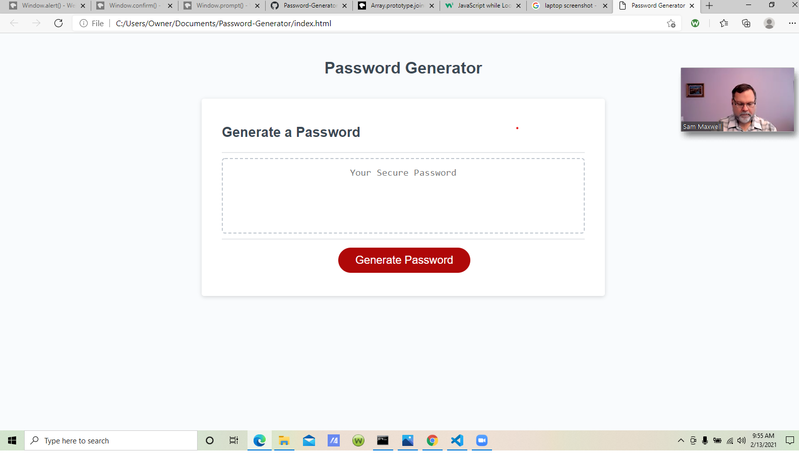

# Password-Generator

Purpose
The purpose of this project was to modify an html document 
of a password generator using only javascript in order to
make it functional.

Tasks Completed
The javascript file was written in order to serve the functioning of the
password generator. It was built to ask the user for input criteria, and 
to process those criteria based on input, and then to generate a random 
password based on those user choices.

Closing
The random password generator was built using javascript strictly, and 
uses input from the user interface to interpret how to assemble the 
random password.

It can be found here

<a href = "//rgivens21.github.io/Password-Generator/">

